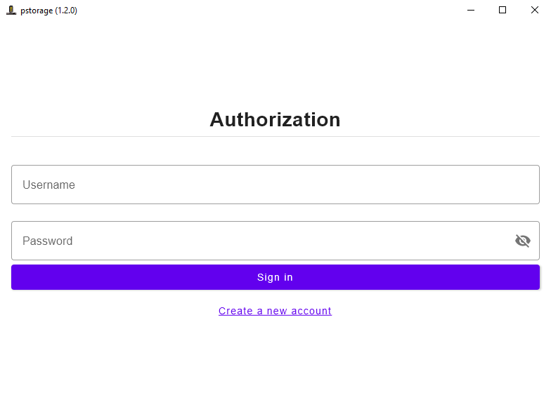
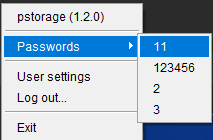

| Branch | Build Status | Code Quality |
|--------|--------------|--------------|
| `main` | todo         |              |
| `dev`  | todo         |              |

<h1 style="font-family: Alef,serif">
     pstorage
</h1>

**pstorage** - simple offline portable password storage application.

## Table of contents

- [How to use](#how-to-use)
    - [Auth window](#auth-window)
    - [Main window](#main-window)
    - [System tray](#system-tray)
- [How to install](#how-to-install)
- [How to build](#how-to-build)
- [How to run for local development](#how-to-run-for-local-development)
- [License](#license)

## How to use

### Auth window

Once app is open you will see auth window:


If you don't have an account you can enter "Login" and "Password" and press "Sign up" button. You
will be followed inside application.

**Be careful:** you can't restore your password if you forget it. Be sure that you remember it or
write down in safe place.

In case of wrong credentials you will see an error.

### Main window

After successful log in you will see main window.

If it's your first log in - table will be empty.

Else you will see information about your passwords as on screenshot below.


On screenshot:

1. Column of passwords' aliases that you will see in System Tray passwords menu. On the right side
   of each record you see "Edit" button that can be used to change Alias value.
2. Placeholder of your password. Here also you can change your password's value (by "edit" button on
   the right side of column).
3. Action buttons:
    - "Copy" button - on press it copies password's value to Clipboard.
    - "Delete" button - delete password that you don't need anymore.
4. Form to add a new password.

### System tray

On launch application creates an icon in system tray.

After successful log in you will see there your passwords' aliases.



On screenshot:

- Application name with version - use this to reopen the main window.
- Passwords menu - all your passwords' aliases. Click on specific element to copy it's password's
  value to clipboard. **Note:** It's blank if you don't have any password or in case if you are not
  authorized.
- Exit button.

## How to install on Windows

1. Download release build for your system from "Releases" section.
2. Run `.msi` installation file.
3. Open `pstorage-multiplatform.exe` in the root of installed directory.

## How to install on MacOS

1. Download release build for your system from "Releases" section.
2. Run `.dmg` installation file. Drag `pstorage-multiplatform.app` into "Application" directory.
3. Open `pstorage-multiplatform.app`.

## How to build

#### Requirements:

- JDK 17

#### Steps

1. Package platform binary using command

```bash
./gradlew packageReleaseDistributionForCurrentOS
```

2. Find built artifact in `build\compose\binaries\main-release\`

## How to run for local development

If you need full application version:

```bash
./gradlew run
```

If you need to preview specific View (`@Composable`) in interactive way:

1. Go to `src/jvmMain/com/github/shaart/pstorage/multiplatform/PreviewMain.kt`
2. Edit view to needed
3. Run with flag `app.preview` = `true`

```bash
./gradlew -Dapp.preview=true run
```

## License

[Apache License 2.0](LICENSE)